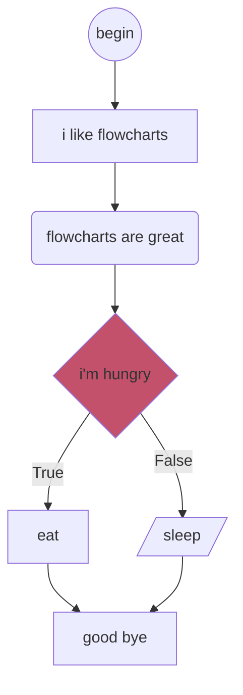

# Unnamed flowchart experiment.

Mermaid is great but readability sucks. What if we could have Mermaid but it's actually javascript but not quite?

Write javascript-like statements and get a Mermaid flowchart right back at you. With _incredibly_ limited functionality[^1].

Future features may or may not include:
- [ ] Tests that actually complete
- [ ] Else if / switch statements
- [ ] While loop
- [x] ~~An end to weird behaviour if you start putting in return; statements.~~ _Potentially fixed, needs some tests_
- [ ] Nicer colours / theming
- [ ] Exporting as svg/png
- [ ] Exporting input text / browser-based storage
- [ ] Syntax highlighting
- [ ] Error messages that are actually useful
- [ ] A UI that doesn't look like it was cobbled together in 20 minutes
- [ ] Actual mermaids

[^1]: May improve with time.


---
```sh
> npm i

# runs the live editor in browser
> npm run dev 

# run the tests
> npm run test

# point cli at a file
> npm run tsc:dev ./path/to/file

# for anything else look at the package.json scripts
```


# Example:

Input:
```js
(('begin'));
i like flowcharts;
(flowcharts are great);
if (i'm hungry) {
  eat;
} else {
  /sleep/;
}
good bye;
```
<details>
<summary>Raw Mermaid output</summary>

```
flowchart TD;
  1(("begin"))
  2["i like flowcharts"]
  3("flowcharts are great")
  4{"i'm hungry"}:::condition
  7["eat"]
  8[/"sleep"/]
  9["good bye"]
  1-->2
  2-->3
  3-->4
  4-->|True|7
  4-->|False|8
  7 & 8-->9

classDef condition fill:#c3516b
```
</details>


Which will render as:

