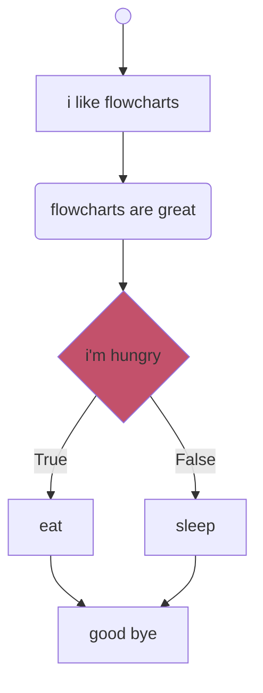

# Unnamed flowchart experiment.

Mermaid is great but readability sucks. What if we could have Mermaid but it's actually javascript but not quite?

Write javascript-like statements and get a Mermaid flowchart right back at you. Which _incredibly_ limited functionality[^1]

[^1]: May improve in future.

```sh
> npm i

# runs the live editor in browser
> npm run dev 

# run the tests
> npm run test[:watch][:coverage] 
```


## Example:
```
((' '));
i like flowcharts;
(flowcharts are great);
if (i'm hungry) {
  eat;
} else {
  sleep;
}
good bye;
```

becomes:
